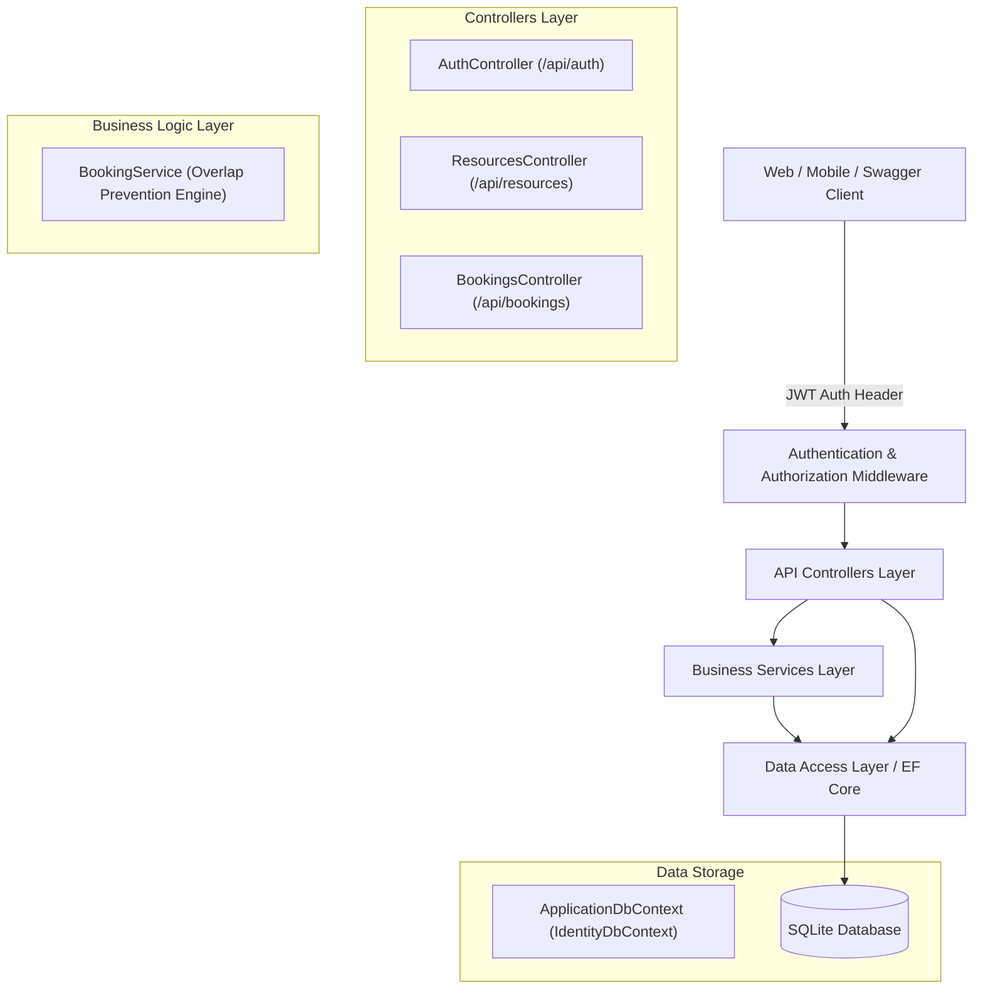

# 🏢 Event & Resource Reservation System

[](https://dotnet.microsoft.com/)
[](https://learn.microsoft.com/ef/core/)
[](https://www.sqlite.org/)
[](https://jwt.io/)
[](https://xunit.net/)

An enterprise-ready **RESTful Web API** built with **ASP.NET Core (.NET 8)** and **Entity Framework Core**, engineered for scheduling and managing multi-tenant resources (rooms, equipment, vehicles) with zero booking collisions.

---

## 🌟 Key Features

- **Double-Booking Overlap Prevention**: Mathematical time-window collision detection (`b.StartTime < end && b.EndTime > start`) while ignoring cancelled and rejected requests.
- **Enterprise Authentication & Authorization**: ASP.NET Core Identity integrated with signed **JWT Bearer Tokens** enforcing Role-Based Access Control (`Admin`, `User`).
- **Admin Resource Catalog CRUD**: Allows administrators to catalog, filter by type/capacity, and toggle availability of resources.
- **Automated xUnit Test Suite**: Full suite of unit tests utilizing **EF Core InMemory Provider** covering edge cases (exact overlap, partial collisions, consecutive slots, cancelled slots).
- **Interactive Swagger / OpenAPI**: Pre-configured with JWT Bearer authentication headers for live API interaction.
- **Zero-Config Portable Database**: Pre-configured with SQLite for cross-platform portability.

---

## 🏗️ Architecture Overview

The system follows clean layered architecture principles:



---

## 🔐 Role-Based Access Matrix

| Endpoint | Method | Role Required | Description |
| :--- | :--- | :--- | :--- |
| `/api/auth/register` | `POST` | Anonymous | Register a new account (`Admin` or `User`) |
| `/api/auth/login` | `POST` | Anonymous | Authenticate and receive signed JWT token |
| `/api/resources` | `GET` | Anonymous / User | Browse active resources (filterable by `type`, `minCapacity`) |
| `/api/resources/{id}` | `GET` | Anonymous / User | Lookup resource details by ID |
| `/api/resources` | `POST` | `Admin` | Add new bookable resource |
| `/api/resources/{id}` | `PUT` | `Admin` | Modify resource details or toggle availability |
| `/api/bookings` | `GET` | `User` / `Admin` | View reservations |
| `/api/bookings` | `POST` | `User` / `Admin` | Reserve resource (triggers overlap validation engine) |

---

## 🚀 Getting Started

### Prerequisites
- [.NET 8 SDK](https://dotnet.microsoft.com/download/dotnet/8.0)
- `dotnet-ef` global tool:
  ```powershell
  dotnet tool install --global dotnet-ef
  ```

### 1. Clone & Build
```powershell
git clone <your-repo-url>
cd ReservationSystem
dotnet build
```

### 2. Run Database Migrations
```powershell
cd ReservationSystem.API
dotnet ef database update
```
*(The migration will automatically seed an initial resource and default roles)*

### 3. Run the API
```powershell
dotnet run --launch-profile "http"
```
The API is now running at: **`http://localhost:5243`**  
Access the interactive Swagger UI at: **`http://localhost:5243/swagger`**

---

## 🧪 Running Unit Tests

The test suite validates collision algorithms against the in-memory database:

```powershell
dotnet test
```

### Test Coverage Highlights:
- ✅ **Exact Match Collision**: Fails overlapping booking for identical start/end range.
- ✅ **Partial Interval Overlap**: Fails overlapping bookings that cross existing boundaries.
- ✅ **Consecutive Back-to-Back Slots**: Permits reservations starting exactly when previous ends.
- ✅ **Cancelled/Rejected Status Exclusion**: Reclaims freed slots from cancelled or rejected reservations.

---

## 🔑 Default Credentials (Seeded on Startup)

- **Admin Account**: `admin@example.com` / `Admin123!`
- **Sample Resource**: `Conference Room A` (ID: `1`, Capacity: `10`, Type: `Room`)

---

## 📝 License
Licensed under the [MIT License](LICENSE).
